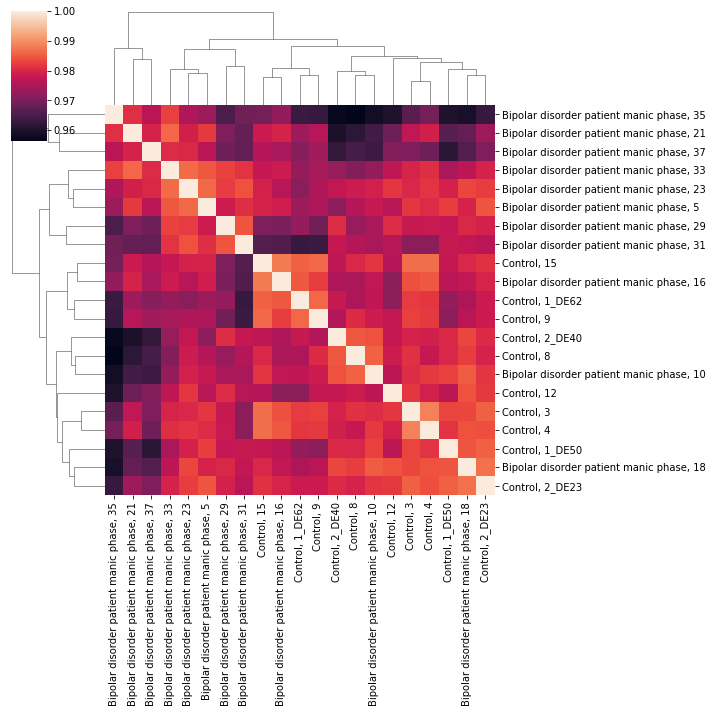

Accessing curated gene expression data with GemmaPy
===================================================

..
 | *Dima Vavilov*, *Guillaume Poirier-Morency*
 | *Michael Smith Laboratories, University of British Columbia, Vancouver, Canada*

About Gemma
-----------

`Gemma <https://gemma.msl.ubc.ca/>`_ is a web site, database and a set
of tools for the meta-analysis, re-use and sharing of genomics data,
currently primarily targeted at the analysis of gene expression
profiles.  Gemma contains data from thousands of public studies,
referencing thousands of published papers.  Every dataset in Gemma has
passed a rigorous curation process that re-annotates the expression
platform at the sequence level, which allows for more consistent
cross-platform comparisons and meta-analyses.

For detailed information on the curation process, read this `page
<https://pavlidislab.github.io/Gemma/curation.html>`_ or the latest
`publication
<https://academic.oup.com/database/article/doi/10.1093/database/baab006/6143045>`_.

Installation instructions
-------------------------

...to be done

Additional packages
-------------------

For the purpose of making plots in this tutorial the following packages should be installed
and imported: *matplotlib*, *plotnine*.

Downloading expression data
---------------------------

The main goal of this wrapper is to enable easy access to Gemma's curated
datasets for downstream analyses or meta-analyses combining multiple
datasets.  In this example, we want to find datasets that are associated
with bipolar disorder, and we are only interested in human data.  In
addition, we will subset our results to datasets that have been batch
corrected.

>>> import gemmapy
>>> api_instance = gemmapy.GemmaPy()
>>> api_response = api_instance.searchDatasets(["bipolar"], taxon="human", limit=100)
>>> for d in api_reponse.data:
...   if d.geeq is not None and  d.geeq.batch_corrected:
...     print(d.short_name, d.name, d.bio_assay_count)
... 
GSE35974 Expression data from the human cerebellum brain 144
GSE46416 State- and trait-specific gene expression in euthymia and mania 32

We are left with two datasets. For simplicity, we'll pick 
`GSE46416 <https://gemma.msl.ubc.ca/expressionExperiment/showExpressionExperiment.html?id=8997>`_
since it has the smaller number of samples. Now that we have the ID
for our experiment, we can fetch the data associated with it.

>>> api_response = api_instance.getDatasetsInfo(["GSE46416"])
>>> for d in api_response.data:
...   print(d.short_name, d.name, d.id)
... 
GSE46416 State- and trait-specific gene expression in euthymia and mania 8997 
>>> print(d.description)
Gene expression profiles of bipolar disorder (BD) patients were assessed during both a manic and a euthymic phase and compared both intra-individually, and with the gene expression profiles of controls.
Last Updated (by provider): Sep 05 2014
Contributors:  Christian C Witt Benedikt Brors Dilafruz Juraeva Jens Treutlein Carsten Sticht Stephanie H Witt Jana Strohmaier Helene Dukal Josef Frank Franziska Degenhardt Markus M Nöthen Sven Cichon Maren Lang Marcella Rietschel Sandra Meier Manuel Mattheisen

To access the expression data in a convenient form, you can use
:py:func:`~gemmapy_api.GemmaPy.getDataset`. It is a high-level wrapper
that combines various endpoint calls to return an `anndata
<https://anndata.readthedocs.io/>`_ (Annotated Data) object of the
queried dataset for downstream analyses. They include the expression
matrix along with the experimental design, and ensure the sample names
match between both when transforming/subsetting data.

>>> adata = api_instance.getDataset("GSE46416")
>>> print(adata)
AnnData object with n_obs × n_vars = 21986 × 32
    obs: 'GeneSymbol', 'GeneName', 'NCBIid'
    var: 'batch', 'disease'
    uns: 'title', 'abstract', 'url', 'database', 'accession', 'GemmaQualityScore', 'GemmaSuitabilityScore', 'taxon'

To show how subsetting works, we'll keep the manic phase data and the
*reference_subject_role*\s, which refers to the control samples in Gemma
datasets.

>>> # Check the levels of the disease factor
>>> adata.var['disease'].unique()
array(['reference_subject_role', 'euthymic_phase_|_Bipolar_Disorder_|',
       'bipolar_disorder_|_manic_phase_|'], dtype=object)

>>> # Subset patients during manic phase and controls
>>> manic=adata[:,(adata.var['disease'] == 'reference_subject_role') |
                      (adata.var['disease'] == 'bipolar_disorder_|_manic_phase_|')].copy()
>>> print(manic)
AnnData object with n_obs × n_vars = 21986 × 21
    obs: 'GeneSymbol', 'GeneName', 'NCBIid'
    var: 'batch', 'disease'
    uns: 'title', 'abstract', 'url', 'database', 'accession', 'GemmaQualityScore', 'GemmaSuitabilityScore', 'taxon'
>>> print(manic.var)
                                                 batch                           disease
Control,1_DE50                       Batch_05_24/11/10            reference_subject_role
Control,12                           Batch_02_26/11/09            reference_subject_role
Control,9                            Batch_01_25/11/09            reference_subject_role
Bipolardisorderpatientmanicphase,5   Batch_05_24/11/10  bipolar_disorder_|_manic_phase_|
Control,15                           Batch_02_26/11/09            reference_subject_role
Bipolardisorderpatientmanicphase,31  Batch_04_02/12/09  bipolar_disorder_|_manic_phase_|
Bipolardisorderpatientmanicphase,29  Batch_03_27/11/09  bipolar_disorder_|_manic_phase_|
Bipolardisorderpatientmanicphase,35  Batch_04_02/12/09  bipolar_disorder_|_manic_phase_|
Bipolardisorderpatientmanicphase,18  Batch_02_26/11/09  bipolar_disorder_|_manic_phase_|
Control,8                            Batch_01_25/11/09            reference_subject_role
Control,3                            Batch_05_24/11/10            reference_subject_role
Control,2_DE23                       Batch_05_24/11/10            reference_subject_role
Control,2_DE40                       Batch_01_25/11/09            reference_subject_role
Bipolardisorderpatientmanicphase,33  Batch_04_02/12/09  bipolar_disorder_|_manic_phase_|
Control,4                            Batch_05_24/11/10            reference_subject_role
Control,1_DE62                       Batch_01_25/11/09            reference_subject_role
Bipolardisorderpatientmanicphase,10  Batch_01_25/11/09  bipolar_disorder_|_manic_phase_|
Bipolardisorderpatientmanicphase,37  Batch_04_02/12/09  bipolar_disorder_|_manic_phase_|
Bipolardisorderpatientmanicphase,23  Batch_03_27/11/09  bipolar_disorder_|_manic_phase_|
Bipolardisorderpatientmanicphase,16  Batch_02_26/11/09  bipolar_disorder_|_manic_phase_|
Bipolardisorderpatientmanicphase,21  Batch_03_27/11/09  bipolar_disorder_|_manic_phase_|

Let's check the expression for every sample to make sure they look OK:

>>> # Plot Expression matrix
>>> import matplotlib.pyplot as plt
>>> plt.figure(figsize=(10,6))
>>> plt.boxplot(manic.X, sym='.')
>>> plt.xticks([])
>>> plt.xlabel('Samples')
>>> plt.ylabel('Expression')
>>> plt.savefig('ded.png')

Gene expression distributions of bipolar patients during manic phase and controls.

You can also use :py:func:`~gemmapy_api.GemmaPy.getDatasetExpression` to only get the expression 
matrix, and :py:func:`~gemmapy_api.GemmaPy.getDatasetDesign` to get the experimental design matrix.

Differential expression analyses
--------------------------------

Gemma also contains precomputed differential expression analyses for
most of its datasets, and some datasets contain more than one analysis
to account for different factors and their interactions. These tables
are stored as resultSets, and you can access them using
:py:func:`~gemmapy_api.GemmaPy.getDatasetDE`. From here on, we can
explore and visualize the data to find the most
differentially-expressed genes:

>>> de = api_instance.getDatasetDE('GSE46416')
>>>
>>> # Classify probes for plotting
>>> de['diffexpr'] = 'No'   # add extra column
>>> de.loc[(de['contrast_bipolar disorder, manic phase_logFoldChange'] > 1.0) &
...        (de['contrast_bipolar disorder, manic phase_pvalue'] < 0.05),'diffexpr'] = 'Up'
>>> de.loc[(de['contrast_bipolar disorder, manic phase_logFoldChange'] < -1.0) &
...        (de['contrast_bipolar disorder, manic phase_pvalue'] < 0.05),'diffexpr'] = 'Down'
>>>
>>> # Upregulated probes
>>> de_up = de[de['diffexpr']=='Up']
>>> de_up = de_up[['Probe','GeneSymbol', 'contrast_bipolar disorder, manic phase_pvalue',
...         'contrast_bipolar disorder, manic phase_logFoldChange']].sort_values(
...         'contrast_bipolar disorder, manic phase_pvalue')
>>> with pandas.option_context('display.max_rows', None, 'display.max_columns', None):
...         print(de_up[:10])
         Probe GeneSymbol  contrast_bipolar disorder, manic phase_pvalue  \
11705  2319550       RBP7                                       0.000179   
13110  2548699     CYP1B1                                       0.000218   
11825  3907190       SLPI                                       0.000625   
18245  3629103      PCLAF                                       0.000961   
18386  3545525      SLIRP                                       0.001044   
3822   3146433      COX6C                                       0.001641   
12209  2538349        NaN                                       0.002130   
2873   2899102       H3C3                                       0.002146   
735    3635198     BCL2A1                                       0.002975   
11879  2633191      GPR15                                       0.003917   
       contrast_bipolar disorder, manic phase_logFoldChange  
11705                                              1.074     
13110                                              1.322     
11825                                              1.056     
18245                                              1.278     
18386                                              1.349     
3822                                               1.467     
12209                                              1.073     
2873                                               1.026     
735                                                1.080     
11879                                              1.205     

>>> # Downregulated probes
>>> de_dn = de[de['diffexpr']=='Down']
>>> de_dn = de_dn[['Probe','GeneSymbol', 'contrast_bipolar disorder, manic phase_pvalue',
>>>         'contrast_bipolar disorder, manic phase_logFoldChange']].sort_values(
>>>         'contrast_bipolar disorder, manic phase_pvalue')
>>> with pandas.option_context('display.max_rows', None, 'display.max_columns', None):
...         print(de_dn[:10])
         Probe  GeneSymbol  contrast_bipolar disorder, manic phase_pvalue  \
11215  2775390         NaN                                       0.000006   
15068  3760268         NaN                                       0.000031   
20918  3124344         NaN                                       0.000278   
4898   3673179         NaN                                       0.000313   
18551  3245871       WDFY4                                       0.000337   
2371   3022689    SND1-IT1                                       0.000448   
2294   2679014         NaN                                       0.000574   
15224  3336402       RBM14                                       0.000675   
15362  4019758         NaN                                       0.000685   
9709   3384417  ANKRD42-DT                                       0.000717   
       contrast_bipolar disorder, manic phase_logFoldChange  
11215                                             -1.556     
15068                                             -1.851     
20918                                             -1.037     
4898                                              -1.034     
18551                                             -1.157     
2371                                              -1.220     
2294                                              -1.175     
15224                                             -1.071     
15362                                             -1.405     
9709                                              -1.003     

>>> # Add gene symbols as labels to DE genes
>>> de['delabel'] = ''
>>> de.loc[de['diffexpr']!='No','delabel'] = de.loc[de['diffexpr']!='No','GeneSymbol']
>>>
>>> # Volcano plot for bipolar patients vs controls
>>> de['-log10(p-value)'] = -np.log10(de['contrast_bipolar disorder, manic phase_pvalue'])
>>> import matplotlib.pyplot as plt
>>> from plotnine import *
>>> plt.figure(figsize=(10,6))
>>> plot=(ggplot(de)
... +aes(
...     x='contrast_bipolar disorder, manic phase_logFoldChange',
...     y='-log10(p-value)',
...     color='diffexpr',
...     labels='delabel'
... )
... +geom_point()
... +geom_hline(yintercept = -np.log10(0.05), color = "gray", linetype = "dashed")
... +geom_vline(xintercept = (-1.0, 1.0), color = "gray", linetype = "dashed")
... +labs(x = "log2(FoldChange)", y = "-log10(p-value)")
... +scale_color_manual(values = ("blue", "black", "red"))+theme_minimal())
... 
>>> plot.save('dea.png', height=6, width=10)

Differentially-expressed genes in bipolar patients during manic phase versus controls.

Larger queries
--------------

The *\*Info()* endpoints accept multiple identifiers in a single
function call. For example, getting information on 2 datasets at the
same time.

>>> api_response = api_instance.getDatasetsInfo(["GSE35974","GSE46416"])
>>> for d in api_response.data:
...             print(d.short_name, d.name, d.id, d.accession, d.bio_assay_count, d.taxon)
... 
GSE35974 Expression data from the human cerebellum brain 5939 GSE35974 144 human
GSE46416 State- and trait-specific gene expression in euthymia and mania 8997 GSE46416 32 human

To query large amounts of data, the API has a pagination system which
uses the *limit* and *offset* parameters. To avoid overloading the server,
calls are limited to a maximum of 100 entries, so the offset allows
you to get the next batch of entries in the next call(s). For
simplicity, this example shows how pagination works with 5 entries per
query.

>>> for ofs in [0,5,10]:
...     api_response=api_instance.getPlatformsInfo([],offset=ofs,limit=5)
...     for d in api_response.data:
...         print(d.id, d.short_name, d.taxon)
...     print('--')
... 
1 GPL96 human
2 GPL1355 rat
3 GPL1261 mouse
4 GPL570 human
5 GPL81 mouse
--
6 GPL85 rat
7 GPL339 mouse
8 GPL91 human
9 GPL890 rat
10 GPL1406 mouse
--
11 GPL891 mouse
12 GPL82 mouse
13 GPL560 mouse
14 GPL1073 mouse
16 GPL369 mouse
--

The rest of the endpoints only support a single identifier:

>>> api_response = api_instance.getDatasetAnnotations(["GSE35974","GSE12649"])
...Error Traceback...

In these cases, you will have to loop over all the identifiers you
wish to query and send separate requests:

>>> for dataset in ["GSE35974","GSE12649"]:
...     api_response = api_instance.getDatasetAnnotations(dataset)
...     for d in api_response.data:
...         print('%s %-15s %-15s %-15s' % (dataset, d.object_class, d.class_name, d.term_name))
...     print('--')
... 
GSE35974 FactorValue     disease         Bipolar Disorder
GSE35974 BioMaterial     biological sex  male           
GSE35974 BioMaterial     biological sex  female         
GSE35974 FactorValue     disease         schizophrenia  
GSE35974 ExperimentTag   organism part   cerebellum     
GSE35974 FactorValue     disease         mental depression
--
GSE12649 BioMaterial     organism part   reference subject role
GSE12649 BioMaterial     disease         Bipolar Disorder
GSE12649 ExperimentTag   organism part   prefrontal cortex
GSE12649 BioMaterial     disease         schizophrenia  
--
